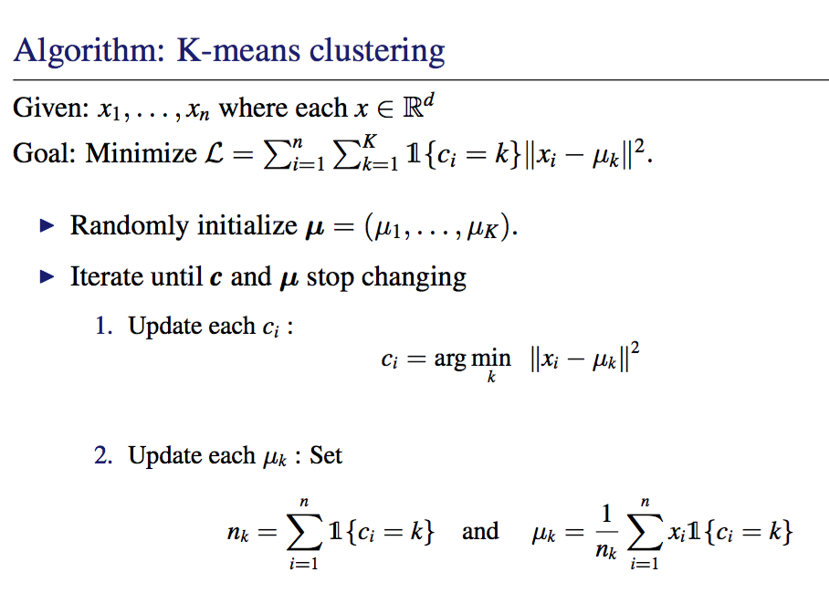
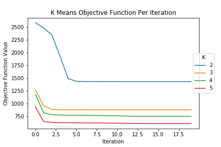
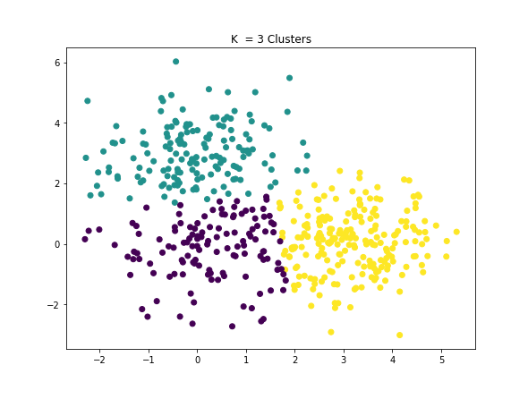
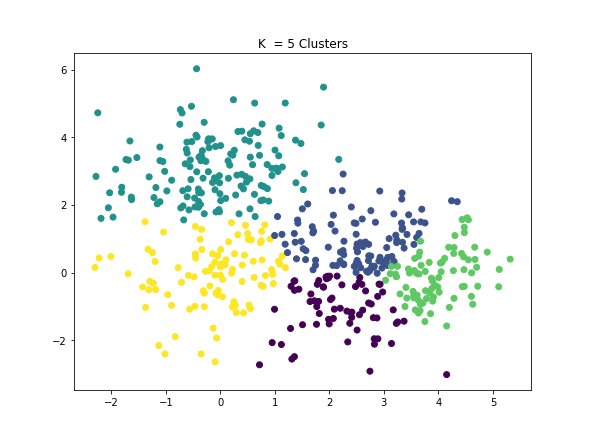

# K-Means
Implementation of the unsupervised clustering algorithm, K-means.

## Data

Data generation process is described in the notebook

## Technology Used
- Python 3

## Algorithm

## Results

K-means objective function per iteration for 20 iterations for K = 2, 3, 4, 5

500 data points for K = 3, in which the cluster of each data point is indicated by a di↵erent color.

500 data points for K = 5, in which the cluster of each data point is indicated by a di↵erent color.

